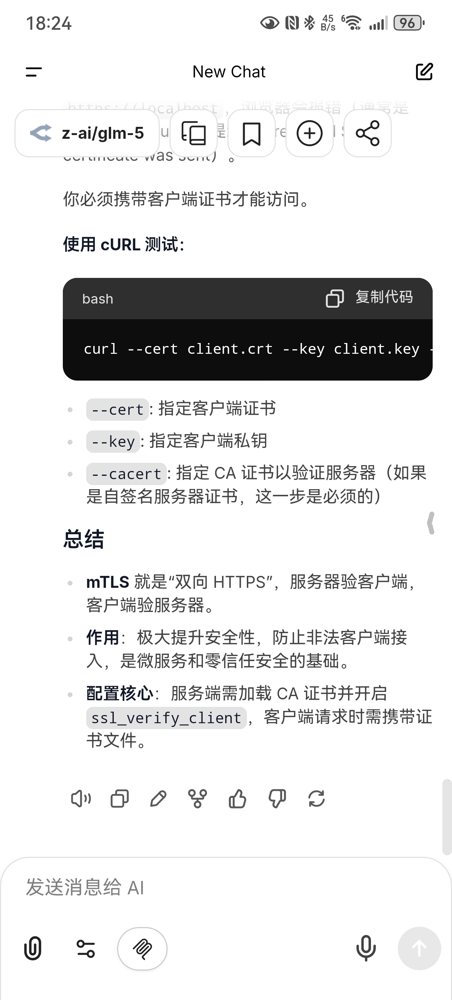
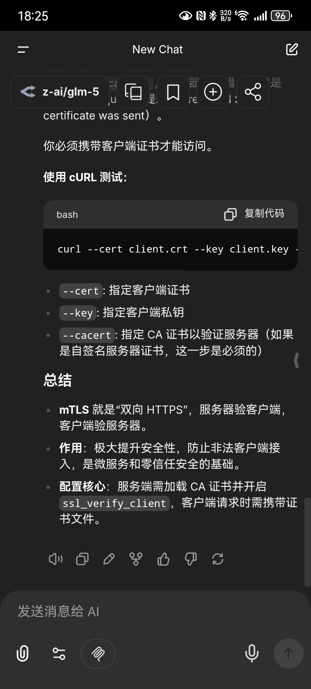

# LibreChatApp

> **Unofficial Client Notice**
>
> This is an **unofficial Android client** for **LibreChat**. It simply wraps the web UI in a
> full-screen WebView so you can access your LibreChat server on Android. It is **not affiliated with
> the official LibreChat team**.

## Screenshots

> The screenshots show the **LibreChat web interface**. This app is just a full-screen WebView wrapper
> with passwordless authentication via mTLS.




---

## Overview

Why I built this:
I use LibreChat on my phone often, but there’s no official app. Using a mobile browser comes with a few
frictions:
1) You still have to go through a login step, even if the browser remembers your password.
2) The LibreChat UI looks great, but the browser’s address bar and menus eat up screen space and get in
   the way of the experience.
3) My LibreChat instance lives on a private network behind an Nginx reverse proxy with mTLS for extra
   security. That setup requires the browser to present and cache client certificates (aliases). Only
   heavyweight browsers like Chrome or Firefox handle this well, and they feel overkill on mobile.

That’s why I built LibreChatApp: a lightweight Android WebView client for a self-hosted LibreChat
server. It supports server URL configuration, mTLS client certificate selection & caching, expiry
warnings, and file upload/download.

---

## Features

- **Server URL configuration** (set on first launch, update anytime)
- **mTLS client certificate support** (pick a cert, cache the alias, expiry warning)
- **Invalid cert handling** (warns a month before expiry and supports server-side revocation)
- **Secure WebView settings** (disallow mixed content, disable third-party cookies)
- **File upload & download support** (HTTP, data URL, blob URL; saved to system Downloads)

---

## Usage

### 1. Set Server URL
On first launch, you must set the server URL. Later, you can tap **"设置服务器地址"** at the bottom
when you’re on the login page or when cookies are missing.

### 2. Client Certificate (mTLS)
If your server uses mutual TLS, the app will prompt you to select a client certificate. The chosen
alias is cached, and you’ll see warnings as the certificate approaches expiration.

### 3. File Upload & Downloads
Supports uploading files in chats and downloading exported conversation records.

---

## Build & Release

### Debug Build
```bash
./gradlew assembleDebug
```

### Generate Keystore
```bash
./generate_keystore.sh
```

### Build Release
```bash
./build_release.sh
```
On success, `release.apk` will be generated in the project root.

---

## Project Structure

```
app/src/main/java/cn/ptdocs/librechatapp/
├── MainActivity.kt               # WebView container & settings entry
├── storage/Prefs.kt              # SharedPreferences (server URL, cert alias)
└── web/
    ├── AppWebChromeClient.kt     # File chooser callbacks
    ├── DownloadHandler.kt        # Download handling (HTTP / data / blob)
    ├── MtlsWebViewClient.kt      # mTLS logic, external link handling, expiry warning
    └── WebViewConfigurator.kt    # WebView security config
```

---

## Permissions

- `android.permission.INTERNET`

---

## License

MIT License. See [LICENSE](LICENSE).
